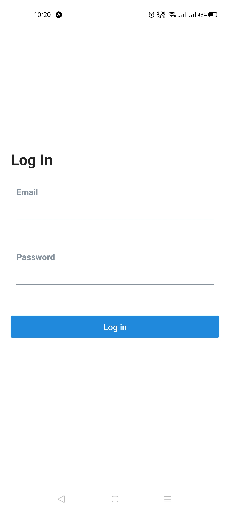
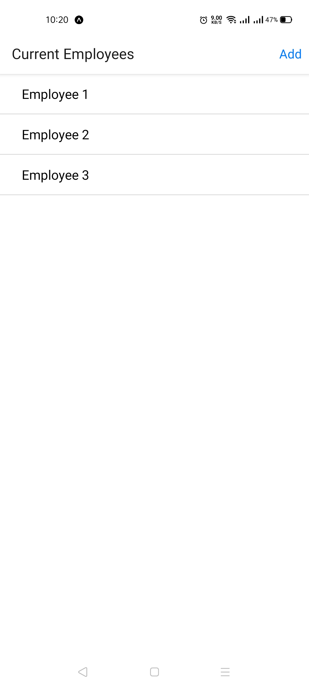
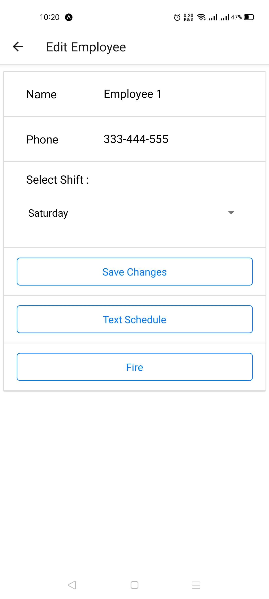
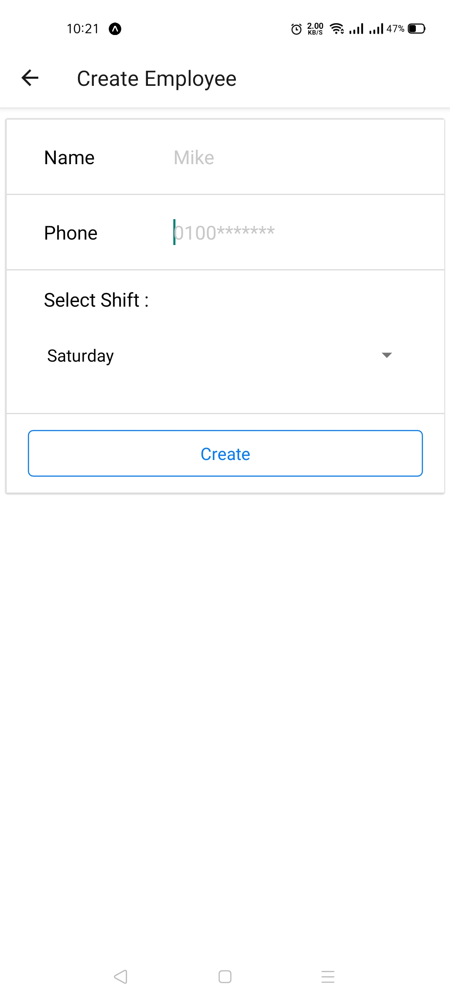
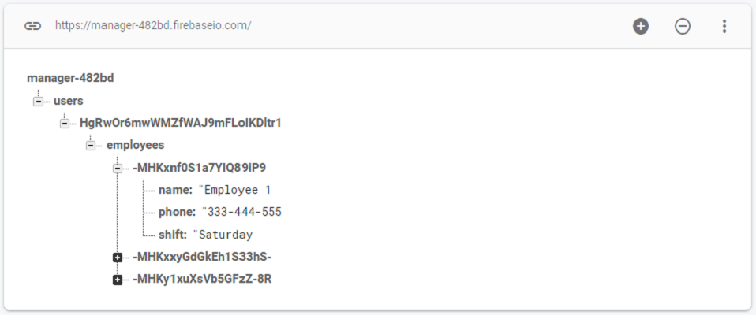

# Manager

An application used to manage employees data ( Add, Edit and Delete ) based on user preference, Stores and fetches data from `Firebase`, built with React Native, Redux, Firebase, JavaScript.

## Project Screen Shots
---

## Main technologies used
---
* [React Native](https://github.com/facebook/react-native)
> A framework for building native apps with React.
* [Redux](https://redux.js.org/)
> Redux is a predictable state container for JavaScript apps.
* [Firebase](https://firebase.google.com/)
> Firebase is a platform developed by Google for creating mobile and web applications.
* [React Native Elements](https://github.com/react-native-elements/react-native-elements)
> Cross Platform React Native UI Toolkit
* [React Native Router Flux](https://github.com/aksonov/react-native-router-flux)
> React Native Router based on new React Native Navigation API

## Installation and Setup Instructions
---
Clone down this repository. You will need `node` and `npm` installed globally on your machine.
 
Installation:
 
`npm install`
 

To Run Test Suite:
 
`npm test`
 

To Start Server:
 
`npm start`
 

To visit app:
 
`http://localhost:19002/`

## Reflection
---
This was a 3 day long project. Project goals included using technologies learned up until this point and familiarizing myself with documentation for new features.

Originally I wanted to build an application that allowed users to manage their businesses by manage employees' shifts. I started this process by using the create-react-app boilerplate, then adding react-router-4.0 and redux.

One of the main challenges I ran into was authentication. This lead me to spend a lot of time on a research, At the end i decided to use Firebase for authentication.

At the end of the day, the technologies implemented in this project are React, React-Router 4.0, Redux, LoDash, and a significant amount of VanillaJS, JSX, and CSS. I chose to use the create-react-app boilerplate to minimize initial setup and invest more time in diving into weird technological rabbit holes. In the next iteration I plan on handrolling a webpack.config.js file to more fully understand the build process.